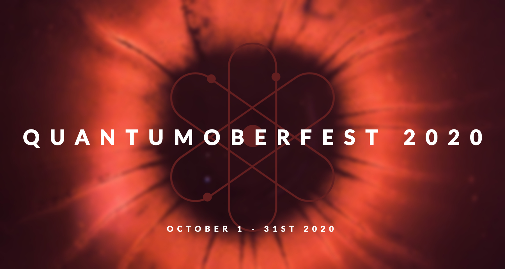
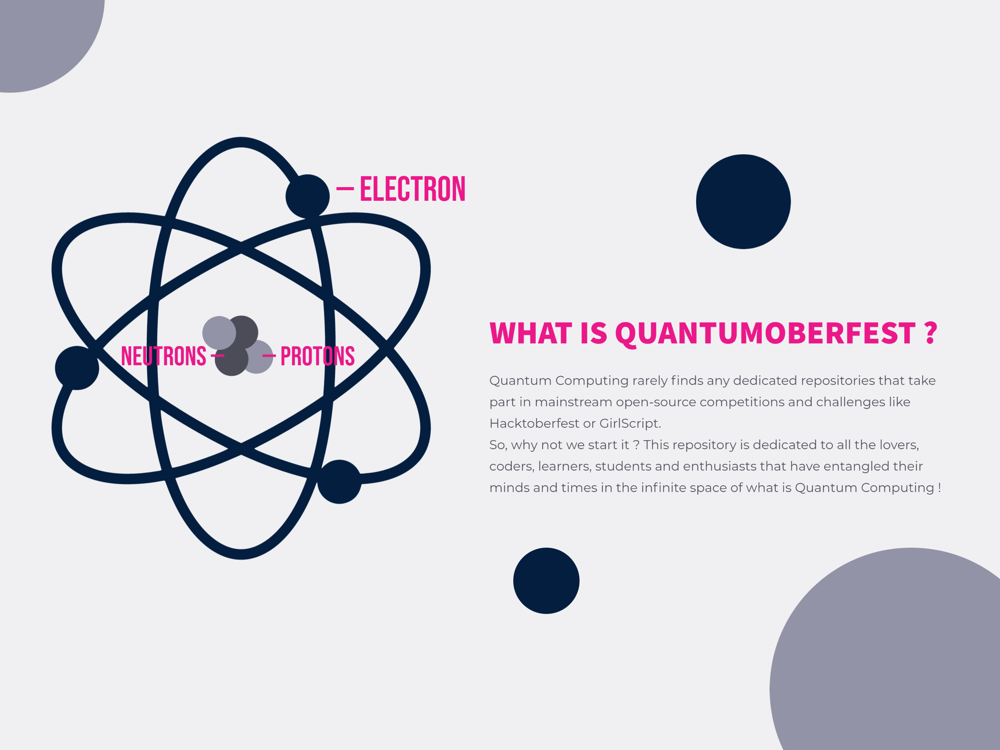

<h1 align="center">
  <b>Quantum Hacktoberfest 2020</b> - <i>Qubits, You & Open-Source</i>
</h1>

<h2 align="center">
  Open-Source forum for all those who love Quantum Computing and enjoy Hacktoberfest as well !
</h2>

## Just 5 simple steps to earning your t-shirt for Hacktoberfest 2020 🧑🏻‍🤝‍🧑🏻
1. 🎯Open the folder of your choice. Each folder is a category you can work and contribute in.
2. 🎯Build anything. We welcome all - Tutorials, Examples, Games, Diagrams, Use-Cases etc. !
3. 🎯Save your changes.
4. 🎯Follow the instructions below to make a new PR ! 
5. 🎯Weekly review done on Sunday 11:00 AM IST. If the PR makes a significant contributions, we will merge it !

## Want to add a new category ? Go ahead ! No issues! 💪
## Want to add a new quantum computing book ? Go ahead ! No issues! 💪
## Want to suggesst some changes in design ? Go ahead ! Open a new ISSUE ! We are have no issues! 💪
## Want to change the 'CONTRIBUTING.md' ? Go ahead ! Open a PR ! No issues! 💪🏼

## Contributing to Hacktoberfest 2020 👨🏼‍💻
 
 
### 💻 Also, we would be planning to host some webinars and open-group discussions on Quantum Computing and related topics. Open an empty PR with name - Let's Talk !  

## Instructions: 🙅🏼 🙅🏼‍♂️
### 1. 👇🏻Register yourself for Hacktoberfest 2019
###### Link to register: https://hacktoberfest.digitalocean.com/

### 2. 👇🏻Star and Fork this Repository
###### You can star ⭐ and fork 🍽️ this repository on GitHub by navigating at the top of this repository.

###### GitHub repository URLs will reference both the username associated with the owner of the repository, as well as the repository name.

###### When you’re on the main page for the repository, you’ll see a button to "Star" and “Fork” the repository on your upper right-hand side of the page, underneath your user icon.

### 3. 👇🏻Clone the Repository

###### To make your own local copy of the repository you would like to contribute to, let’s first open up a terminal window.

###### We’ll use the `git clone`  command along with the URL that points to your fork of the repository.

###### This URL will be similar to the URL above, except now it will end with `.git.`

###### You can alternatively copy the URL by using the green “Clone or download” button from your repository page that you just forked from the original repository page. Once you click the button, you’ll be able to copy the URL by clicking the binder button next to the URL.

###### Once we have the URL, we’re ready to clone the repository. To do this, we’ll combine the git clone command with the repository URL from the command line in a terminal window:

`git clone https://github.com/your-username/Quantum-Hacktoberfest20.git`

### 4. 👇🏻Create a New Branch

###### To create your branch, from your terminal window, change your directory so that you are working in the directory of the repository. Be sure to use the actual name of the repository to change into that directory.

#####    ` cd Quantum-Hacktoberfest20`

###### Now, we’ll create our new branch with the git branch command. Make sure you name it descriptively so that others working on the project understand what you are working on.

##### `git branch new-branch`

###### Now that our new branch is created, we can switch to make sure that we are working on that branch by using the git checkout command:

##### ` git checkout new-branch `

###### Once you enter the git `checkout` command, you will receive the following output:

######  `Output:` 
#####  `Switched to branch 'new-branch' `

 
###### At this point, you can now modify existing files or add new files to the project on your own branch.
###### Make sure you have read the <a href="CONTRIBUTING.md">contributing.md</a> before you start contributing such that you make remarkable and easily acceptable PRs.

### 5. 👇🏻Make Changes Locally & Add them

###### Once you have modified existing files or added new files to the project, you can add them to your local repository, which you can do with the git add command. Let’s add the -A flag to add all changes that we have made:

##### ` git add -A ` or ` git add . `

###### Next, we’ll want to record the changes that we made to the repository with the git commit command.

###### The commit message is an important aspect of your code contribution; it helps the other contributors fully understand the change you have made, why you made it, and how significant it is. Additionally, commit messages provide a historical record of the changes for the project at large, helping future contributors along the way. Thus, you must ensure that you write a meaningful commit message. If in a confusion, refer to the good contribution guidelines included in the ##### ` contributing.md `

###### If you have a very short message, you can record that with the -m flag and the message in quotes:

###### ` Example: ` 
##### ` git commit -m "Updated Readme.md" `

###### Switch to the local master branch of our repository:

##### ` git checkout master `

###### Now merge any changes that were made in the original repository’s master branch, that you will access through your local upstream/master branch, with your local master branch:

##### ` git merge upstream/master `

### 6. 👇🏻Create Pull Request

###### At this point, you are ready to make a pull request to the original repository. Make PRs' to the develop branch only!

###### Now navigate to your forked repository, and press the “New pull request” button on your left-hand side of the page.

## 👑 👑 Hurray!!! You just got closer to completing your hacktoberfest challenge. 😃 Take a print of this certificate below to flaunt your new accomplishment !

## Happy?? Star ⭐ this Repo. 🤩 for future updates on Quantum Computing and Hacktoberfest'20 !

## 🎩 Check your Hacktoberfest Contribution status at: 🙅🏼‍♂️
<a href="https://hacktoberfest.digitalocean.com/profile" target="blank">https://hacktoberfest.digitalocean.com/profile</a>

&nbsp;
Voila!

## 👬 Innovation Courtesy to - 

<a href="https://github.com/ajay-cogsci"> <b>Ajay Agarwal</b></a>
 
👩‍🎓 Undergraduate CS&E Student | 💻 Open-Source Contributor | 💌 Qiskit is bae :)	 | ❤️ Psychology Lover  | Introvert & HSP 🌤️

## 🙅🏼‍♂️ License 🗣
The MIT License (MIT)

Copyright (c) 2020 Ajay Agarwal QuantumMinds

Permission is hereby granted, free of charge, to any person obtaining a copy
of this software and associated documentation files (the "Software"), to deal
in the Software without restriction, including without limitation the rights
to use, copy, modify, merge, publish, distribute, sublicense, and/or sell
copies of the Software, and to permit persons to whom the Software is
furnished to do so, subject to the following conditions:

The above copyright notice and this permission notice shall be included in all
copies or substantial portions of the Software.

THE SOFTWARE IS PROVIDED "AS IS", WITHOUT WARRANTY OF ANY KIND, EXPRESS OR
IMPLIED, INCLUDING BUT NOT LIMITED TO THE WARRANTIES OF MERCHANTABILITY,
FITNESS FOR A PARTICULAR PURPOSE AND NONINFRINGEMENT. IN NO EVENT SHALL THE
AUTHORS OR COPYRIGHT HOLDERS BE LIABLE FOR ANY CLAIM, DAMAGES OR OTHER
LIABILITY, WHETHER IN AN ACTION OF CONTRACT, TORT OR OTHERWISE, ARISING FROM,
OUT OF OR IN CONNECTION WITH THE SOFTWARE OR THE USE OR OTHER DEALINGS IN THE
SOFTWARE.

#  🤓  Thanks to our awesome contributors  🤓 
